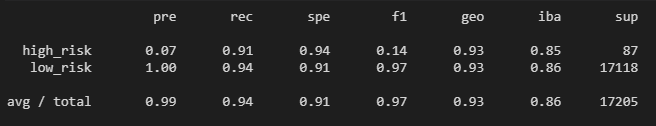

# Risky Business
This project is to test my understanding of machine-learning model building along with predicting credit risk taught in the Rice University FinTech Bootcamp.[1]

---

## Table of contents
* [General Information](#general-information)
* [Summaries](#summaries)
* [Technologies](#technologies)
* [Installation Guide](#installation-guide)
* [Code Examples](#code-examples)
* [Usage](#usage)
* [Sources](#sources)
* [Status](#status)
* [Contributors](#contributors)

---

## General Information
Loans of any kind such as automotive loans, mortgage, student loans, and debt consolidation, are just a few examples consumers are seeking online.  Peer-to-peer lending services such as LendingClub or Prosper allow investors to loan other people money without the use of a bank. However, investors always want to mitigate risk, so the following repository was created to help a client use machine learning techniques to predict credit risk.[1]

### Summaries

#### Resampling
* Which model had the best balanced accuracy score?
    * The Synthetic Minority Oversampling Technique (SMOTE) model produced the best balanced accuracy score, 79.67%.
* Which model had the best recall score?
    * The best recall score was produced by using the SMOTE model producing 71% recall for high risk loans and 88% recall for low risk loans.
* Which model had the best geometric mean score?
    * The best geometric mean scores produced were 79% using the SMOTE model.

#### Ensemble Learning
* Which model had the best balanced accuracy score?
    * The Easy Ensemble Classifier produced the best balanced accuracy score, 92.55%.
* Which model had the best recall score?
    * The best recall score was produced by using the Easy Ensemble Classifier producing 91% recall for high risk loans and 94% recall for low risk loans.
* Which model had the best geometric mean score?
    * The best geometric mean scores produced were 93% using the Easy Ensemble Classifier.
* What are the top three features?
    * The top three features are:
        1. Principle Received to Date (total_rec_prncp): 0.0738
        2. Interest Received to Date (total_rec_int): 0.0639
        3. Payments Received to Date for Portion of Total Amount Funded by Investors (total_pymnt_inv): 0.0607

---

## Technologies

* See [requirements.txt](./resources/requirements.txt) for a list of libraries to create a machine learning environment.

---

## Installation Guide

1. Download the entire repository
2. Open Git Terminal
3. Navigate into the repository file path where you stored the files during the download.
4. The notebook files should be visible to run.
5. Make sure to create a separate virtual environment for the machine-learning libraries.
6. Use [requirements.txt](./resources/requirements.txt) in the repository to install the libraries using the following command:

``` python
pip install -r requirements.txt
```

*See the [Usage](#usage) section below for instructions on how to run notebooks.

---

## Code Examples

* Creating a standard scaler instance and training the model

``` python
# Create the StandardScaler instance
from sklearn.preprocessing import StandardScaler

scaler = StandardScaler()

# Fit the Standard Scaler with the training data
# When fitting scaling functions, only train on the training dataset
X_scaler = scaler.fit(X_train)

# Scale the training and testing data
X_train_scaled = X_scaler.transform(X_train)
X_test_scaled = X_scaler.transform(X_test)
```

* Showing the imbalanced classification report for easy ensemble classifier

``` python
# Print the imbalanced classification report
print(classification_report_imbalanced(y_test, y_eec_predictions))
```

* 

---

## Usage

1. To run the analysis process, navigate to credit_risk_resampling.ipynb using Git Terminal within the directory risky_business.

2. Execute the command 'code .' in the terminal to open VS Code.

3. VS Code opens.  Select the credit_risk_resampling.ipynb file found in the left side navigation pane.

4. Click the Run All Cells button, double arrows, found at the top of the main workspace to run all cells in the Jupyter Notebook file.

5. All cells in the notbook run.

* Follow steps 1 - 5 to run the credit_risk_ensemble.ipynb notebook.

---

## Sources

- [1] https://rice.bootcampcontent.com/Rice-Coding-Bootcamp/rice-hou-fin-pt-09-2020-u-c/tree/master/hw/11-Machine-Learning/Instructions

---

## Status

Project is: _finished_

---

## Contributors

* Jonathan Owens
* LinkedIn: www.linkedin.com/in/jonowens
